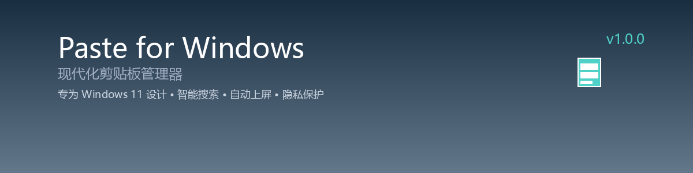
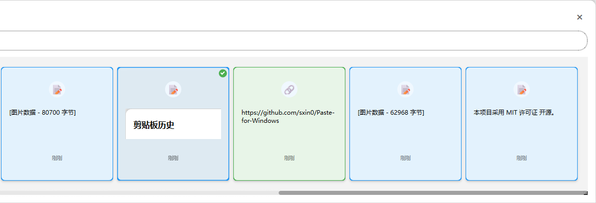

# Paste for Windows

<div align="center">




**专为 Windows 11 设计的现代化剪贴板管理器**

[功能特性](#-功能特性) • [快速开始](#-快速开始) • [文档](#-文档) • [贡献](#-贡献) • [许可证](#-许可证)

</div>

---

## 🎯 项目简介

Paste for Windows 是一个专为 Windows 11 设计的现代化剪贴板管理器，参考了 macOS 上优秀的 Paste 应用，并针对 Windows 平台进行了深度优化。它提供了强大的剪贴板管理功能，帮助用户更高效地管理和使用剪贴板内容。

## 📸 应用截图

### 🖥️ 主界面
<div align="center">

<p><em>现代化的剪贴板历史管理界面，支持实时搜索和内容预览</em></p>
</div>

### 🎨 功能特性展示
<div align="center">

<p><em>丰富的功能特性，覆盖剪贴板管理的各个方面</em></p>
</div>

### 🔧 系统托盘
<div align="center">

<p><em>便捷的系统托盘菜单，快速访问核心功能</em></p>
</div>

### ✨ 核心特性

- 🔄 **实时监听** - 自动捕获所有剪贴板变化
- 📋 **多格式支持** - 文本、图片、文件、链接等
- 🔍 **智能搜索** - 全文搜索、模糊匹配、高级过滤
- ⭐ **收藏管理** - 重要内容收藏、标签系统
- 🎨 **现代化界面** - Windows 11 风格、毛玻璃效果
- ⚡ **高性能** - 轻量级、快速响应
- 🔒 **隐私保护** - 本地存储、数据加密
- 🚀 **系统集成** - 全局热键、系统托盘、开机自启
- 🚀 **自动上屏** - 双击卡片直接输入到当前窗口

## 🚀 快速开始

### 📋 系统要求

- **操作系统**: Windows 10 (1903+) / Windows 11
- **架构**: x64
- **内存**: 4GB RAM (推荐 8GB)
- **存储**: 100MB 可用空间
- **Python**: 3.9 或更高版本

### ⚡ 快速安装

#### 方法一：使用安装脚本（推荐）

```bash
# 克隆项目
git clone https://github.com/sxin0/Paste-for-Windows.git
cd paste-for-windows

# 运行安装脚本
python install.py
```

#### 方法二：手动安装

```bash
# 克隆项目
git clone https://github.com/sxin0/Paste-for-Windows.git
cd paste-for-windows

# 创建虚拟环境
python -m venv venv
venv\Scripts\activate

# 安装依赖
pip install -r requirements.txt

# 运行应用
python main.py
```

### 🎮 基本使用

1. **启动应用**: 运行后应用会自动最小化到系统托盘
2. **呼出界面**: 按 `Alt + V` 快捷键呼出主窗口
3. **复制内容**: 正常复制任何内容，应用会自动记录
4. **搜索历史**: 在搜索框中输入关键词快速查找
5. **粘贴历史**: 双击或右键选择要粘贴的内容

<div align="center">

<p><em>💡 提示：双击任意剪贴板卡片即可自动输入到当前窗口</em></p>
</div>

## 📁 项目结构

```
paste-for-windows/
├── 📁 src/                          # 源代码目录
│   ├── 📁 core/                     # 核心模块
│   │   ├── clipboard_manager.py     # 剪贴板管理核心
│   │   ├── data_processor.py        # 数据处理器
│   │   ├── search_engine.py         # 搜索引擎
│   │   └── config_manager.py        # 配置管理
│   ├── 📁 gui/                      # 图形界面
│   │   ├── main_window.py           # 主窗口
│   │   ├── clipboard_list.py        # 剪贴板列表组件
│   │   ├── preview_panel.py         # 预览面板
│   │   ├── settings_dialog.py       # 设置对话框
│   │   └── system_tray.py           # 系统托盘
│   ├── 📁 data/                     # 数据层
│   │   ├── database.py              # 数据库操作
│   │   ├── models.py                # 数据模型
│   │   └── cache_manager.py         # 缓存管理
│   ├── 📁 utils/                    # 工具类
│   │   ├── hotkey_manager.py        # 热键管理
│   │   ├── file_utils.py            # 文件工具
│   │   └── system_utils.py          # 系统工具
│   └── 📁 services/                 # 服务层
│       ├── windows_api.py           # Windows API 封装
│       ├── notification_service.py  # 通知服务
│       └── sync_service.py          # 同步服务
├── 📁 resources/                    # 资源文件
│   ├── 📁 icons/                    # 图标文件
│   ├── 📁 images/                   # 图片资源
│   └── 📁 locales/                  # 多语言文件
├── 📁 tests/                        # 测试文件
├── 📁 docs/                         # 文档
├── main.py                          # 程序入口
├── requirements.txt                 # 依赖列表
└── README.md                        # 项目说明
```

## 🔧 核心模块功能

### 📋 剪贴板管理器 (ClipboardManager)
- **实时监听**: 自动捕获剪贴板变化
- **多格式支持**: 文本、图片、文件、链接等
- **内容识别**: 智能识别内容类型
- **数据预处理**: 格式转换和优化

### 🔍 搜索引擎 (SearchEngine)
- **全文搜索**: 基于 Whoosh 的全文搜索引擎
- **模糊匹配**: 支持模糊搜索和拼写纠错
- **高级过滤**: 按类型、时间、大小等过滤
- **搜索历史**: 记录搜索历史，快速重复搜索

### 💾 数据库管理 (DatabaseManager)
- **SQLite 存储**: 轻量级本地数据库
- **数据模型**: 完整的数据结构设计
- **缓存管理**: 内存缓存提升性能
- **数据导出**: 支持多种格式导出

### 🎨 用户界面 (GUI)
- **现代化设计**: Windows 11 风格界面
- **响应式布局**: 自适应不同屏幕尺寸
- **主题切换**: 深色/浅色主题支持
- **动画效果**: 流畅的界面动画

## 🎯 主要功能特性

### ✨ 核心功能
1. **自动剪贴板监听** - 实时捕获剪贴板变化
2. **多格式支持** - 文本、图片、文件路径、链接
3. **智能搜索** - 全文搜索、模糊匹配、高级过滤
4. **收藏功能** - 标记重要内容，快速访问
5. **标签系统** - 自定义标签，分类管理
6. **数据持久化** - SQLite 本地存储

### 🎮 用户交互
1. **全局快捷键** - `Win + V` 呼出主窗口
2. **自动上屏** - 双击卡片直接输入到当前窗口
3. **系统托盘** - 右键菜单快速操作
4. **键盘导航** - 支持键盘快捷键操作
2. **系统托盘** - 最小化到托盘，右键菜单
3. **现代化界面** - 简洁美观的 GUI
4. **右键菜单** - 复制、收藏、删除等操作
5. **拖拽操作** - 支持拖拽整理内容

### ⚙️ 配置选项
1. **常规设置** - 开机自启、通知、语言
2. **剪贴板设置** - 监听间隔、内容类型过滤
3. **外观设置** - 主题、透明度、字体大小
4. **快捷键设置** - 自定义全局快捷键

### 🔧 高级功能
1. **使用统计** - 详细的使用数据分析
2. **数据导出** - 支持 JSON/TXT/CSV 格式
3. **数据导入** - 从其他剪贴板管理器导入
4. **备份恢复** - 自动备份和数据恢复
5. **性能监控** - 内存使用和性能监控

## 🚀 自动上屏功能

### 功能概述
自动上屏功能允许您双击剪贴板卡片，直接将内容输入到当前激活的应用程序中，无需手动复制粘贴。

### 使用方法
1. **打开剪贴板历史**：按 `Win+V` 或点击系统托盘图标
2. **选择目标窗口**：将光标放在要输入内容的应用程序中（如微信对话框、记事本等）
3. **双击卡片**：双击任意剪贴板卡片，内容将自动输入到当前窗口

### 支持的应用
- ✅ **即时通讯**：微信、QQ、钉钉、Telegram
- ✅ **办公软件**：Word、Excel、PowerPoint、记事本
- ✅ **浏览器**：Chrome、Edge、Firefox（地址栏、搜索框）
- ✅ **代码编辑器**：VS Code、PyCharm、Sublime Text
- ✅ **其他应用**：大多数支持文本输入的应用程序

### 技术特点
- **智能输入**：支持剪贴板和键盘两种输入方式
- **安全检查**：自动检测危险窗口，保护系统安全
- **自动回退**：失败时自动回退到剪贴板方式
- **内容保护**：自动恢复原始剪贴板内容

### 测试功能
```bash
# 运行自动上屏测试
python test_auto_type.py
```

## 📱 Windows 11 特色功能

### 系统集成
- **Windows 11 设计语言** - 遵循 Fluent Design
- **任务栏集成** - 任务栏快速访问
- **开始菜单** - 开始菜单快捷方式
- **文件资源管理器** - 右键菜单集成

### 性能优化
- **Windows 11 优化** - 针对新系统优化
- **硬件加速** - GPU 加速渲染
- **内存管理** - 智能内存使用
- **启动优化** - 快速启动

### 安全特性
- **Windows Defender** - 兼容性认证
- **权限管理** - 最小权限原则
- **数据加密** - 敏感数据保护

## 📦 依赖关系

### Python 依赖包
```python
# GUI 框架
PyQt6>=6.4.0              # 现代化 GUI 框架
PyQt6-Qt6>=6.4.0          # Qt6 核心库

# 系统集成
pywin32>=305              # Windows API 访问
keyboard>=0.13.5          # 全局热键支持
pystray>=0.19.4           # 系统托盘支持
pyautogui>=0.9.54         # 自动上屏功能

# 数据处理
pillow>=9.5.0             # 图像处理
python-magic>=0.4.27      # 文件类型检测
chardet>=5.1.0            # 字符编码检测

# 搜索功能
whoosh>=2.7.4             # 全文搜索引擎
jieba>=0.42.1             # 中文分词

# 配置管理
pydantic>=1.10.0          # 数据验证
toml>=0.10.2              # 配置文件格式

# 开发工具
pytest>=7.3.1             # 测试框架
black>=23.3.0             # 代码格式化
mypy>=1.3.0               # 类型检查
```

## 🚀 部署方式

### 开发环境
```bash
# 克隆项目
git clone https://github.com/sxin0/Paste-for-Windows.git
cd paste-for-windows

# 创建虚拟环境
python -m venv venv
venv\Scripts\activate

# 安装开发依赖
pip install -r requirements-dev.txt

# 运行测试
pytest

# 启动开发服务器
python main.py --dev
```

### 生产环境
```bash
# 构建应用
python build.py

# 安装包
pip install dist/paste_for_windows-1.0.0-py3-none-any.whl

# 运行应用
paste-for-windows
```

### 后台运行
```bash
# 后台运行
python main.py --background

# 开机自启
python main.py --autostart
```

## 📚 文档

- [功能特性文档](FEATURES.md) - 详细的功能特性说明
- [技术架构文档](ARCHITECTURE.md) - 技术架构和设计文档
- [开发路线图](ROADMAP.md) - 项目开发计划和里程碑
- [API 文档](docs/API.md) - 开发者 API 文档
- [部署指南](docs/DEPLOYMENT.md) - 部署和安装指南
- [贡献指南](docs/CONTRIBUTING.md) - 如何贡献代码

## 🤝 贡献

我们欢迎所有形式的贡献！请查看我们的 [贡献指南](docs/CONTRIBUTING.md) 了解如何参与项目开发。

### 贡献方式
- 🐛 **报告 Bug** - 在 GitHub Issues 中报告问题
- 💡 **功能建议** - 提出新功能建议
- 📝 **文档改进** - 改进文档和翻译
- 🔧 **代码贡献** - 提交 Pull Request
- ⭐ **Star 项目** - 给项目点个 Star

### 开发环境设置
```bash
# 克隆项目
git clone https://github.com/sxin0/Paste-for-Windows.git
cd paste-for-windows

# 安装开发依赖
pip install -r requirements-dev.txt

# 运行测试
pytest

# 代码格式化
black src/
isort src/

# 类型检查
mypy src/
```

## 📄 许可证

本项目采用 [MIT 许可证](LICENSE) 开源。

## 🙏 致谢

- 感谢 [Paste for Mac](https://pasteapp.io/) 的灵感
- 感谢所有贡献者的支持
- 感谢开源社区的力量

## 📞 联系我们

- **GitHub**: [https://github.com/sxin0/Paste-for-Windows](https://github.com/sxin0/Paste-for-Windows)
- **Issues**: [https://github.com/sxin0/Paste-for-Windows/issues](https://github.com/sxin0/Paste-for-Windows/issues)

---

<div align="center">

**如果这个项目对你有帮助，请给它一个 ⭐ Star！**

Made with ❤️ for Windows users

</div>